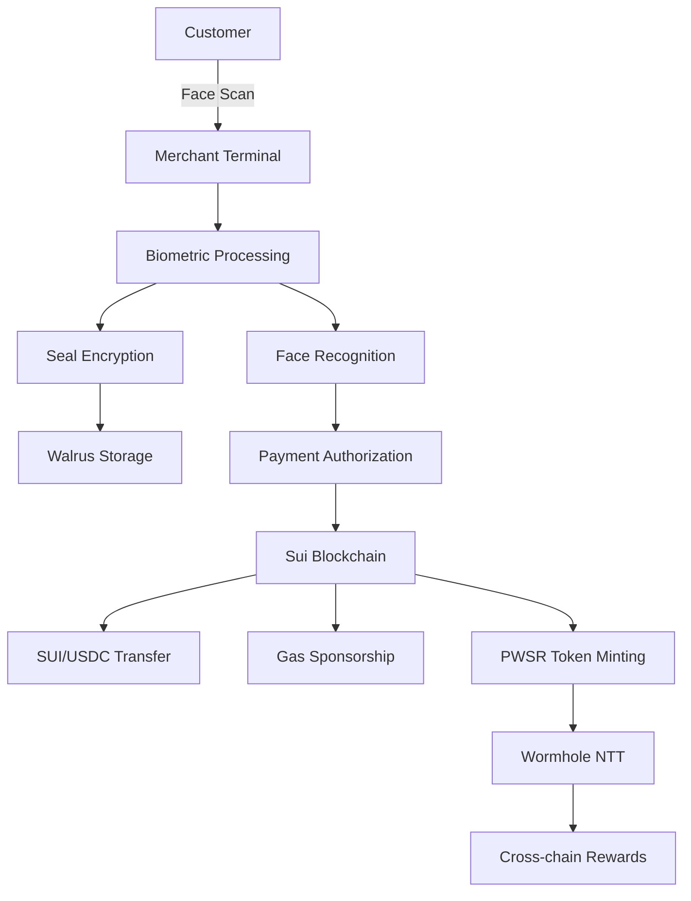

# PayWiser - Biometric Payment System on Sui Blockchain

[](https://sui.io)
[](https://nextjs.org)
[](https://nodejs.org)
[](https://typescriptlang.org)

PayWiser is a revolutionary biometric payment system built on the Sui blockchain that enables secure, seamless transactions using facial recognition technology. The system combines cutting-edge biometric authentication with blockchain-powered payments, enhanced by privacy-preserving protocols.

## 🌟 Key Features

### 🔐 **Biometric Authentication**
- **Face Recognition**: Advanced facial recognition using Luxand FaceSDK
- **Privacy-First**: Biometric templates encrypted using Seal Protocol
- **Real-time Processing**: Instant customer identification at merchant terminals
- **High Accuracy**: 99.5%+ accuracy with quality validation

### ⛓️ **Sui Blockchain Integration**
- **Native SUI Transfers**: Seamless SUI token transactions
- **USDC Support**: Circle's official testnet USDC integration
- **Gas Sponsorship**: Merchants can sponsor customer transaction fees
- **Smart Contracts**: Secure, auditable payment processing

### 🎁 **PayWiser Token Rewards**
- **Earn PWSR**: 1 PayWiser token per 1 USDC spent
- **Cross-chain Rewards**: Exchange tokens across multiple chains
- **Wormhole NTT**: Native Token Transfer integration for seamless bridging
- **Multi-chain Support**: Arbitrum, Sepolia, Base, Polygon

### 🔒 **Privacy & Security**
- **Seal Protocol**: Encrypted biometric storage with on-chain policies
- **zkLogin Integration**: Seamless OAuth-based user onboarding
- **Fresh Nonce System**: Prevents replay attacks
- **Walrus Storage**: Decentralized storage for biometric templates

## 🏗️ Architecture



## 🚀 Technology Stack

### **Frontend**
- **Next.js 14**: React-based web application
- **TypeScript**: Type-safe development
- **Tailwind CSS**: Modern, responsive styling
- **Framer Motion**: Smooth animations and transitions
- **Sui SDK**: Blockchain interactions

### **Backend**
- **Node.js**: Server-side JavaScript runtime
- **Express.js**: Web application framework
- **Luxand FaceSDK**: Facial recognition engine
- **Sui SDK**: Blockchain integration
- **Seal Protocol**: Encrypted biometric storage

### **Blockchain**
- **Sui Blockchain**: High-performance L1 blockchain
- **Move Language**: Smart contract development
- **Circle USDC**: Stablecoin payments
- **Wormhole NTT**: Cross-chain token transfers

### **Privacy & Storage**
- **Seal Protocol**: Encrypted biometric data with on-chain policies
- **Walrus Protocol**: Decentralized storage network
- **zkLogin**: Privacy-preserving authentication

## 📁 Project Structure

```
PayWiser/
├── frontend/                 # Next.js web application
│   ├── app/
│   │   ├── merchant/        # Merchant terminal interface
│   │   ├── user/            # Customer dashboard
│   │   └── verification-marketplace/
│   ├── components/          # Reusable UI components
│   └── lib/                 # Utilities and configurations
│
├── backend/                 # Node.js API server
│   ├── src/
│   │   ├── services/        # Business logic services
│   │   │   ├── suiService.js       # Sui blockchain integration
│   │   │   ├── sealService.js      # Seal Protocol encryption
│   │   │   └── faceEnrollmentService.js # Biometric processing
│   │   ├── routes/          # API endpoints
│   │   └── config/          # Configuration files
│   ├── face-recognition/    # Luxand FaceSDK integration
│   ├── token/              # PayWiser token deployment
│   └── seal/               # Seal Protocol integration
│
└── docs/                   # Documentation and examples
```

## 🛠️ Quick Start

### Prerequisites
- Node.js 18+
- npm or yarn
- Sui CLI (for blockchain interactions)
- Luxand FaceSDK license (for face recognition)

### 1. Clone Repository
```bash
git clone https://github.com/atharvalade/PayWiser_Sui.git
cd PayWiser_Sui
```

### 2. Backend Setup
```bash
cd backend
npm install

# Configure environment variables
cp .env.example .env
# Edit .env with your configuration
```

### 3. Frontend Setup
```bash
cd frontend
npm install
```

### 4. Start Development Servers
```bash
# Backend (Terminal 1)
cd backend
npm start

# Frontend (Terminal 2)
cd frontend
npm run dev
```

### 5. Access Applications
- **Merchant Terminal**: http://localhost:3001/merchant
- **User Dashboard**: http://localhost:3001/user
- **API Server**: http://localhost:3000

## 🔧 Configuration

### Environment Variables

#### Backend (.env)
```bash
# Sui Configuration
SUI_RPC_URL=https://fullnode.testnet.sui.io:443
NETWORK=testnet
GAS_SPONSOR_PRIVATE_KEY=your_sponsor_private_key

# PayWiser Token
PAYWISER_TOKEN_PACKAGE_ID=0x5ee7df19f113857e35fc001127a84d56d705a4ea8b0fc1d7cfff677e5d9076a4

# USDC Configuration
USDC_COIN_TYPE=0xa1ec7fc00a6f40db9693ad1415d0c193ad3906494428cf252621037bd7117e29::usdc::USDC

# Seal Protocol
SEAL_PACKAGE_ID=0x...
SEAL_VERIFIER_PRIVATE_KEY=your_verifier_key

# Face Recognition
LUXAND_LICENSE_KEY=your_luxand_license
```

#### Frontend (.env.local)
```bash
NEXT_PUBLIC_API_URL=http://localhost:3000
NEXT_PUBLIC_SUI_NETWORK=testnet
```

## 🎯 Core Features

### 1. Biometric Payment Flow

```javascript
// Customer face capture and recognition
const faceData = await captureCustomerFace();
const encryptedBiometrics = await sealService.encrypt(faceData);
const customer = await recognizeCustomer(encryptedBiometrics);

// Process payment with gas sponsorship
const payment = await suiService.transferUSDCWithSponsorship({
  from: customer.walletAddress,
  to: merchant.walletAddress,
  amount: paymentAmount,
  sponsor: merchant.sponsorAddress
});

// Mint reward tokens
await mintPayWiserTokens(customer.address, paymentAmount);
```

### 2. Cross-chain Token Exchange

```javascript
// Exchange PWSR tokens for cross-chain rewards
const exchange = await wormholeNTT.bridgeTokens({
  sourceChain: 'sui',
  targetChain: 'arbitrum',
  amount: 100, // PWSR tokens
  recipient: userAddress
});
```

### 3. Privacy-Preserving Storage

```javascript
// Encrypt and store biometric data
const encryptedData = await sealService.encryptBiometricData(
  faceEmbeddings,
  userId,
  terminalId
);

// Create on-chain access policy
const policy = await sealService.createOnChainPolicy({
  requiresFreshNonce: true,
  maxAge: 3600000, // 1 hour
  allowedVerifiers: [verifierAddress]
});
```

## 🔗 API Endpoints

### Wallet Management
- `POST /api/wallet/create` - Create new Sui wallet
- `POST /api/wallet/balance` - Check wallet balances

### Payments
- `POST /api/transfer/usdc` - Transfer USDC tokens
- `POST /api/transfer/sui` - Transfer SUI tokens
- `POST /api/sponsor/transfer` - Sponsored transactions

### Biometrics
- `POST /api/face/enroll` - Enroll customer biometrics
- `POST /api/face/recognize` - Recognize customer
- `GET /api/face/status/:address` - Check enrollment status

### Seal Protocol
- `POST /api/seal/encrypt` - Encrypt biometric data
- `POST /api/seal/decrypt` - Decrypt with policy validation
- `POST /api/seal/generate-nonce` - Generate fresh nonce

## 🌐 Supported Networks

### Sui Blockchain
- **Testnet**: Primary development network
- **Mainnet**: Production deployment ready

### Cross-chain Support (via Wormhole NTT)
- **Arbitrum**: Layer 2 Ethereum scaling solution
- **Sepolia**: Ethereum testnet
- **Base**: Coinbase's Layer 2 network
- **Polygon**: Multi-chain scaling platform

## 🔐 Security Features

### Biometric Security
- **Template Encryption**: All biometric templates encrypted at rest
- **On-chain Policies**: Access control via smart contracts
- **Fresh Nonce System**: Prevents replay attacks
- **Quality Validation**: Ensures high-quality biometric captures

### Blockchain Security
- **Gas Sponsorship**: Secure transaction fee management
- **Multi-signature Support**: Enhanced transaction security
- **Audit Trail**: All transactions recorded on-chain
- **Smart Contract Security**: Audited Move contracts

### Privacy Protection
- **Zero-knowledge Proofs**: Privacy-preserving verification
- **Encrypted Storage**: Biometric data never stored in plaintext
- **Selective Disclosure**: Users control data sharing
- **GDPR Compliance**: Right to erasure and data portability

## 📊 Performance Metrics

- **Face Recognition**: <500ms average processing time
- **Transaction Speed**: <2s for SUI/USDC transfers
- **Encryption**: <100ms for biometric data encryption
- **Cross-chain Bridging**: <5min via Wormhole NTT
- **Accuracy**: 99.5%+ face recognition accuracy

## 🚀 Deployment

### Development
```bash
# Start all services
npm run dev:all

# Or start individually
npm run dev:backend
npm run dev:frontend
```

### Production
```bash
# Build applications
npm run build

# Deploy to production
npm run deploy
```

### Docker Deployment
```bash
# Build and run containers
docker-compose up -d

# Scale services
docker-compose up -d --scale backend=3
```

## 🧪 Testing

```bash
# Run all tests
npm test

# Test specific components
npm test -- --grep "Seal Protocol"
npm test -- --grep "Face Recognition"
npm test -- --grep "Sui Integration"

# End-to-end testing
npm run test:e2e
```

## 📚 Documentation

- [**API Documentation**](./docs/api.md)
- [**Deployment Guide**](./docs/deployment.md)
- [**Security Best Practices**](./docs/security.md)
- [**Seal Protocol Integration**](./backend/seal/README.md)
- [**Face Recognition Setup**](./backend/face-recognition/README.md)

## 🤝 Contributing

1. Fork the repository
2. Create your feature branch (`git checkout -b feature/AmazingFeature`)
3. Commit your changes (`git commit -m 'Add some AmazingFeature'`)
4. Push to the branch (`git push origin feature/AmazingFeature`)
5. Open a Pull Request

## 📄 License

This project is licensed under the MIT License - see the [LICENSE](LICENSE) file for details.

## 🙏 Acknowledgments

- **Sui Foundation**: For the high-performance blockchain platform
- **Circle**: For USDC stablecoin integration
- **Wormhole**: For cross-chain token transfer capabilities
- **Luxand**: For advanced face recognition technology
- **Seal Protocol**: For privacy-preserving biometric storage
- **Walrus Protocol**: For decentralized storage solutions

## 📞 Support

- **Documentation**: [PayWiser Docs](https://docs.paywiser.io)
- **Discord**: [Join our community](https://discord.gg/paywiser)
- **Email**: support@paywiser.io
- **Issues**: [GitHub Issues](https://github.com/atharvalade/PayWiser_Sui/issues)

---

**Built with ❤️ for the future of payments**

*PayWiser - Where biometrics meet blockchain for seamless, secure payments.*
